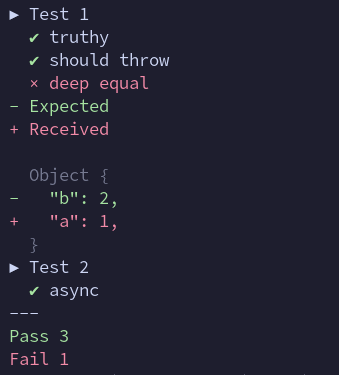

# Testra

Minimal test runner



**[Documentation - API](https://eliot-akira.github.io/testra/api/) · [Source](https://github.com/eliot-akira/testra)**

## Install

```sh
npm install --save-dev testra
```

## Overview

1. Create tests with title and callback (can be async).
2. Call asserts inside test: `is`, `ok`, `not`, `throws`.
3. Run the tests with `run`.

```js
import { test, is, ok, run, throws } from 'testra'

test('Test 1', () => {
  ok(true, 'truthy')
  is({ a: 1 }, { b: 2 }, 'deep equal')
  throws(() => someFn(), 'should throw')
})

test('Test 2', async () => {
  await new Promise(resolve => setTimeout(resolve, 1000))
  ok(true, 'async')
})

run()
```

## Universal

The test report uses `console` to display the results with visual structure. In the browser it uses `console.group` and CSS to style some text. On the server it uses ANSI color sequences for the terminal; it also exits with code `1` when any test fails, for use in build and test pipeline.
